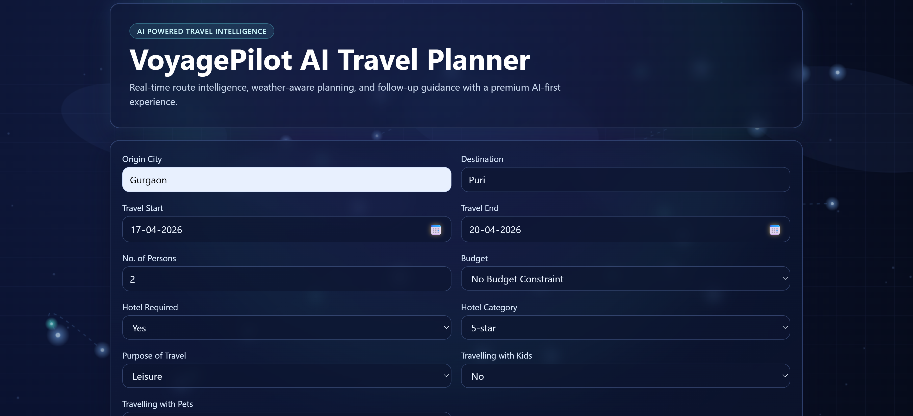
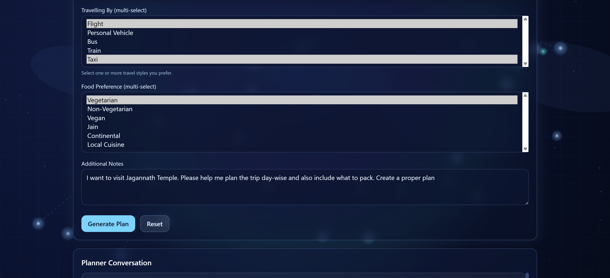
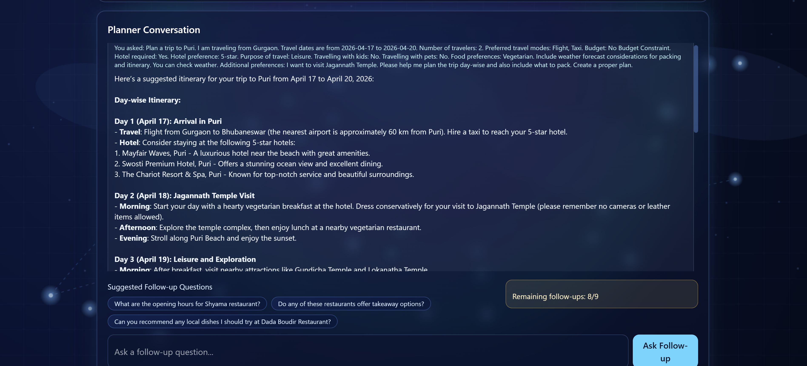
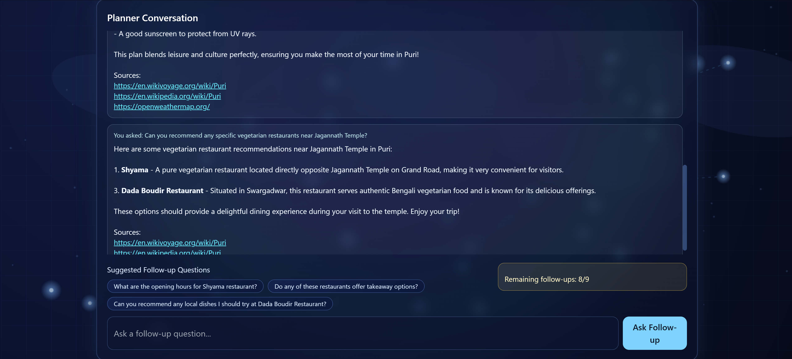

# VoyagePilot AI - Smart Travel Planner

Production-grade AI travel planner with an immersive animated frontend, tool-using agent workflow, and grounded source-backed responses.

## Highlights

- Agent workflow with planning + tool execution + grounded response synthesis
- RAG retrieval over travel content (FAISS + OpenAI embeddings)
- Auto-ingestion for unseen destinations
- Weather + news tool integration
- Nearby-location fallback when weather location cannot be resolved exactly
- Follow-up question support with memory
- Sources always appended in answer body as direct links
- Premium animated UI (map routes, particles, parallax)

## Current Tech Stack

- Python 3.10+
- FastAPI
- LangGraph / LangChain
- OpenAI (LLM + Embeddings)
- FAISS
- crawl4ai + requests fallback
- OpenWeatherMap API
- NewsAPI
- Tailwind CSS (CDN) + Vanilla JS

## Project Structure

```text
app/
+-- main.py
+-- core/
¦   +-- config.py
+-- agent/
¦   +-- executor.py
¦   +-- planner.py
¦   +-- prompts.py
+-- ingestion/
¦   +-- crawler.py
¦   +-- cleaner.py
¦   +-- chunker.py
¦   +-- pipeline.py
+-- memory/
¦   +-- conversation.py
+-- rag/
¦   +-- embedder.py
¦   +-- retriever.py
¦   +-- vector_store.py
+-- tools/
    +-- weather.py
    +-- news.py

frontend/
+-- index.html

data/
+-- faiss_store/
```

## Setup

```powershell
python -m venv .venv
.venv\Scripts\Activate.ps1
pip install -r requirements.txt
Copy-Item .env.example .env
```

### Required `.env` keys

- `OPENAI_API_KEY`
- `OPENWEATHER_API_KEY`
- `NEWS_API_KEY`

### Optional `.env` keys

- `OPENAI_MODEL` (default `gpt-4o-mini`)
- `OPENAI_EMBEDDING_MODEL` (default `text-embedding-3-small`)
- `FAISS_INDEX_DIR` (default `data/faiss_store`)
- `LOG_LEVEL` (default `INFO`)
- `CRAWL4AI_ENABLED` (default `false` on Windows)

## Run

```powershell
python -m uvicorn app.main:app --reload --port 8000
```

Open:
- UI: `http://127.0.0.1:8000/`
- Docs: `http://127.0.0.1:8000/docs`
- Health: `http://127.0.0.1:8000/health`

## API

### POST `/query`

Request:

```json
{
  "query": "Plan a trip to Kashmir with weather details",
  "location": "Kashmir"
}
```

Response:

```json
{
  "answer": "Here is your travel plan...\n\nSources:\nhttps://en.wikivoyage.org/wiki/Kashmir\nhttps://openweathermap.org/",
  "sources": ["https://..."],
  "actions_taken": ["weather_tool:auto_first_answer"],
  "suggested_followups": ["...", "...", "..."]
}
```

## Example Session (Jagannath Temple - Puri)

### Example Query

```text
Plan a trip to Puri. I am traveling from Gurgaon. Travel dates are from 2026-04-17 to 2026-04-20.
Number of travelers: 2. Preferred travel modes: Flight, Taxi. Budget: No Budget Constraint.
Hotel required: Yes. Hotel preference: 5-star. Purpose of travel: Leisure. Travelling with kids: No.
Travelling with pets: No. Food preferences: Vegetarian. Include weather forecast considerations for packing and itinerary.
You can check weather. Additional preferences: I want to visit Jagannath Temple.
Please help me plan the trip day-wise and also include what to pack. Create a proper plan.
```

### Example Response

```text
Here’s a suggested itinerary for your trip to Puri from April 17 to April 20, 2026:

Day-wise Itinerary:

Day 1 (April 17): Arrival in Puri
- Travel: Flight from Gurgaon to Bhubaneswar (the nearest airport is approximately 60 km from Puri). Hire a taxi to reach your 5-star hotel.
- Hotel: Mayfair Waves, Swosti Premium Hotel, The Chariot Resort & Spa.

Day 2 (April 18): Jagannath Temple Visit
- Morning: Vegetarian breakfast and temple visit prep (no camera/leather items).
- Afternoon: Temple complex + lunch at nearby vegetarian restaurant.
- Evening: Puri Beach sunset walk.

Day 3 (April 19): Leisure and Exploration
- Gundicha Temple, Lokanatha Temple, local markets, Odisha crafts.

Day 4 (April 20): Departure
- Relaxed morning, checkout, taxi to Bhubaneswar Airport.

Packing Suggestions:
- Light breathable clothing (warm and humid weather).
- Umbrella/raincoat, comfortable sandals, sunscreen.

Sources:
https://en.wikivoyage.org/wiki/Puri
https://en.wikipedia.org/wiki/Puri
https://openweathermap.org/
```

### Example Follow-up

```text
Question: Can you recommend any specific vegetarian restaurants near Jagannath Temple?

Answer:
1. Shyama - opposite Jagannath Temple on Grand Road.
2. Dada Boudir Restaurant - known for Bengali vegetarian options.

Sources:
https://en.wikivoyage.org/wiki/Puri
https://en.wikipedia.org/wiki/Puri
```

## UI Screenshots

Add your images under `docs/screenshots/` and keep these names:

- `planner-hero-form.png`
- `planner-form-lower.png`
- `planner-conversation-main.png`
- `planner-conversation-followup.png`

Markdown embeds:

```md




```

Rendered preview (auto-shows once images are added):


## Behavioral Notes

- First answer auto-includes weather when location is available.
- If exact weather place is missing, nearby matching place is used and called out.
- If location is not in vector DB, ingestion runs automatically.
- Follow-ups are capped in UI and remain query-grounded.
- Hotel suggestions are only forced when `Hotel required: Yes` is present in query context.

## Windows Notes

- Some Windows environments can fail Playwright subprocess calls.
- Fallback scraping via `requests` is included.
- Keep `CRAWL4AI_ENABLED=false` unless you explicitly need crawl4ai browser mode.

## Git Safety

- `.env` is ignored by `.gitignore`.
- Rotate keys immediately if exposed.
- Add auth/rate limits before public deployment.

## Deploy To GitHub

```powershell
git init
git add .
git commit -m "Initial commit: VoyagePilot AI Travel Planner"
git branch -M main
git remote add origin https://github.com/<your-username>/<your-repo>.git
git pull origin main --rebase
git push -u origin main
```

If you hit a merge conflict in `README.md` during rebase:

```powershell
git add README.md
git rebase --continue
git push -u origin main
```
